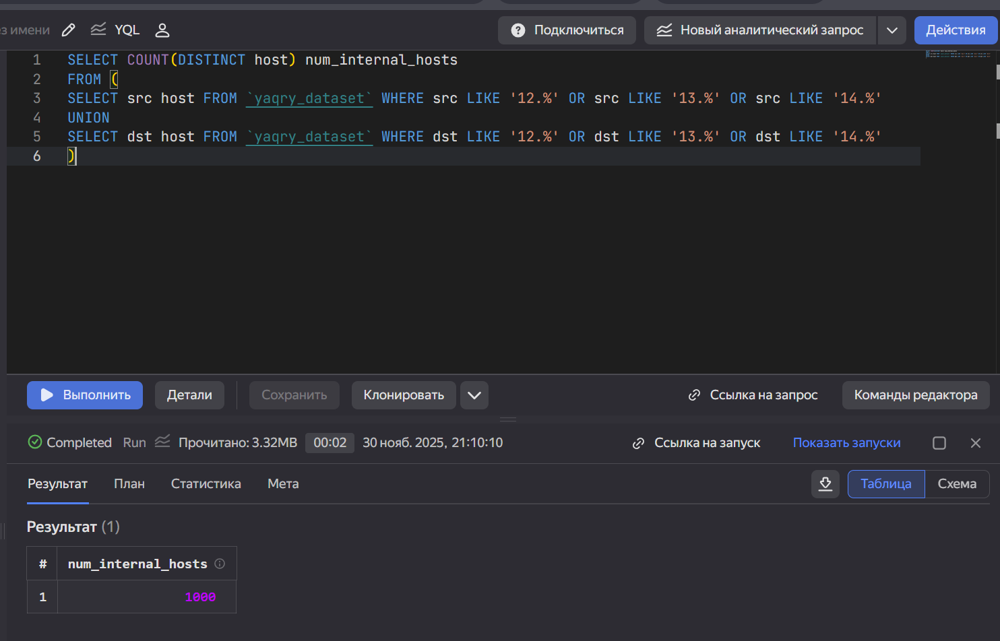
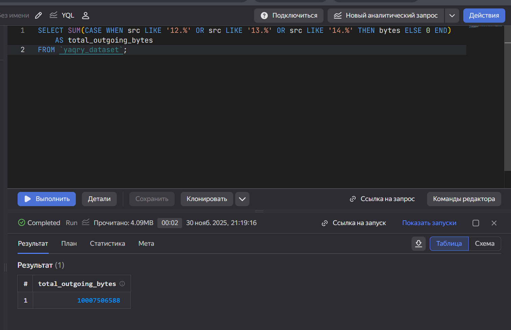
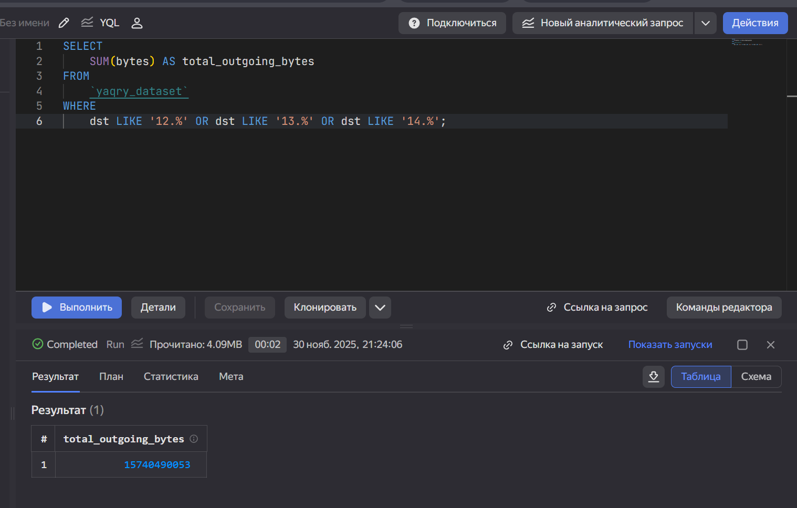

# Использование технологии Yandex Query для анализа данных сетевой
активности


## Цель работы

1.  Изучить возможности технологии Yandex Query для анализа
    структурированных наборов данных
2.  Получить навыки построения аналитического пайплайна для анализа
    данных с помощью сервисов Yandex Cloud
3.  Закрепить практические навыки использования SQL для анализа данных
    сетевой активности в сегментированной корпоративной сети

## Исходные данные

1.  Программное обеспечение ОС Windows 10
2.  R Studio
3.  Интерпретатор языка R 4.5.1

## План

1.  Используя сервис Yandex Query настроить доступ к данным, хранящимся
    в сервисе хранения данных Yandex Object Storage.
2.  Проверьте доступность данных (файл yaqry_dataset.pqt) в бакете
    arrow-datasets S3 хранилища Yandex Object Storage.
3.  Известно, что IP адреса внутренней сети начинаются с октетов,
    принадлежащих интервалу \[12-14\]. Определите количество хостов
    внутренней сети, представленных в датасете.
4.  Определите суммарный объем исходящего трафика.
5.  Определите суммарный объем входящего трафика.

## Шаги:

1.  Библиотеки.

``` r
options(repos = c(CRAN = "https://mirror.truenetwork.ru/CRAN/"))
install.packages("arrow")
```

    Устанавливаю пакет в 'C:/Users/ignat/AppData/Local/R/win-library/4.5'
    (потому что 'lib' не определено)

    пакет 'arrow' успешно распакован, MD5-суммы проверены

    Warning: не могу удалить прежнюю установку пакета 'arrow'

    Warning in file.copy(savedcopy, lib, recursive = TRUE): проблема с копированием
    C:\Users\ignat\AppData\Local\R\win-library\4.5\00LOCK\arrow\libs\x64\arrow.dll
    в C:\Users\ignat\AppData\Local\R\win-library\4.5\arrow\libs\x64\arrow.dll:
    Permission denied

    Warning: восстановлен 'arrow'


    Скачанные бинарные пакеты находятся в
        C:\Users\ignat\AppData\Local\Temp\Rtmpwnw95P\downloaded_packages

``` r
install.packages("dplyr")
```

    Устанавливаю пакет в 'C:/Users/ignat/AppData/Local/R/win-library/4.5'
    (потому что 'lib' не определено)

    пакет 'dplyr' успешно распакован, MD5-суммы проверены

    Warning: не могу удалить прежнюю установку пакета 'dplyr'

    Warning in file.copy(savedcopy, lib, recursive = TRUE): проблема с копированием
    C:\Users\ignat\AppData\Local\R\win-library\4.5\00LOCK\dplyr\libs\x64\dplyr.dll
    в C:\Users\ignat\AppData\Local\R\win-library\4.5\dplyr\libs\x64\dplyr.dll:
    Permission denied

    Warning: восстановлен 'dplyr'


    Скачанные бинарные пакеты находятся в
        C:\Users\ignat\AppData\Local\Temp\Rtmpwnw95P\downloaded_packages

``` r
library(arrow)
```

    Warning: пакет 'arrow' был собран под R версии 4.5.2


    Присоединяю пакет: 'arrow'

    Следующий объект скрыт от 'package:utils':

        timestamp

``` r
library(dplyr)
```

    Warning: пакет 'dplyr' был собран под R версии 4.5.2


    Присоединяю пакет: 'dplyr'

    Следующие объекты скрыты от 'package:stats':

        filter, lag

    Следующие объекты скрыты от 'package:base':

        intersect, setdiff, setequal, union

1.  Импорт данных.

<!-- -->

    dataset_path <- "https://storage.yandexcloud.net/arrow-datasets/yaqry_dataset.pqt"
    > local_file <- "yaqry_dataset.pqt"
    > 
    > if (!file.exists(local_file)) {
    +     tryCatch({
    +         download.file(url = dataset_path, destfile = local_file, mode = "wb")
    +         message("Файл успешно загружен")
    +     }, error = function(e) {
    +         stop("Ошибка при загрузке файла: ", e$message)
    +     })
    + }
    > 
    > net_traffic <- arrow::open_dataset(local_file, format = "parquet")
    > 

1.  Известно, что IP адреса внутренней сети начинаются с октетов,
    принадлежащих интервалу 12-14. Определите количество хостов
    внутренней сети, представленных в датасете.

<!-- -->

    > internal_network_patterns <- c("12.", "13.", "14.")
    > 
    > internal_hosts_count <- net_traffic %>%
    +     
    +     filter(
    +         substr(src, 1, 3) %in% internal_network_patterns |
    +             substr(dst, 1, 3) %in% internal_network_patterns
    +     ) %>%
    +     
    +     collect() %>%
    +     summarise(
    +         unique_hosts = n_distinct(c(src[substr(src, 1, 3) %in% internal_network_patterns],
    +                                     dst[substr(dst, 1, 3) %in% internal_network_patterns]))
    +     ) %>%
    +     pull(unique_hosts)
    > 
    > print(internal_hosts_count)
    [1] 1000



1.  Определите суммарный объем исходящего трафика.

<!-- -->

    > outgoing_traffic <- net_traffic %>%
    +     mutate(src_network = substr(src, 1, 3)) %>%
    +     filter(src_network %in% c("12.", "13.", "14.")) %>%
    +     summarise(
    +         total_bytes = sum(as.numeric(bytes), na.rm = TRUE)
    +     ) %>%
    +     collect() %>%
    +     pull(total_bytes)
    > 
    > print(outgoing_traffic)
    [1] 10007506588



1.  Определите суммарный объем входящего трафика.

<!-- -->

    incoming_traffic <- net_traffic %>%
    +     mutate(dst_prefix = substr(dst, 1, 3)) %>%
    +     filter(dst_prefix %in% c("12.", "13.", "14.")) %>%
    +     group_by(is_internal = TRUE) %>%
    +     summarise(
    +         incoming_total = sum(bytes, na.rm = TRUE)
    +     ) %>%
    +     ungroup() %>%
    +     collect() %>%
    +     pull(incoming_total)
    > 
    > print(incoming_traffic)
    integer64
    [1] 15740490053



## #Вывод: Таким образом, мы научились использовать инструменты языка R совместно с Yandex Query.
