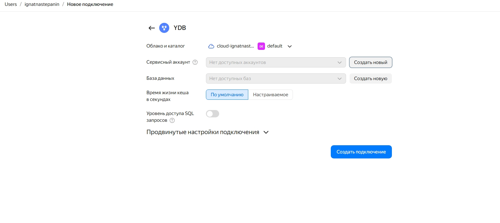
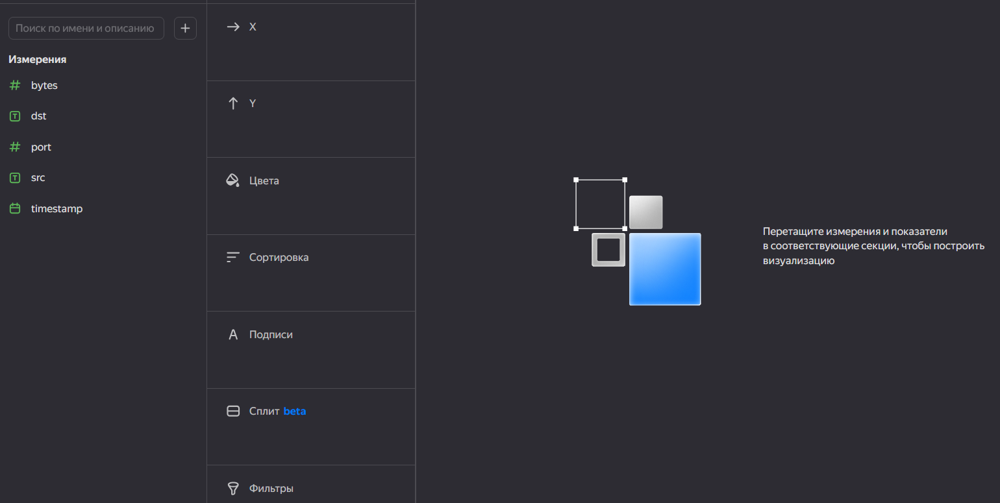
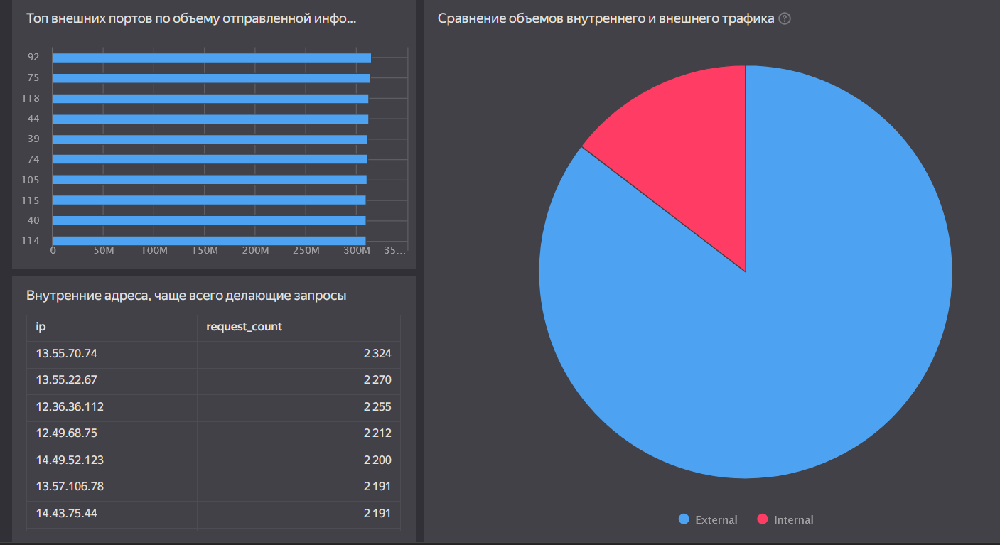

# Использование технологии Yandex DataLens для анализа данных сетевой
активности

## Цель работы

1 Изучить возможности технологии Yandex DataLens для визуального анализа
структурированных наборов данных

2 Получить навыки визуализации данных для последующего анализа с помощью
сервисов Yandex Cloud

3 Получить навыки создания решений мониторинга/SIEM на базе облачных
продуктов и открытых программных решений

4 Закрепить практические навыки использования SQL для анализа данных
сетевой активности в сегментированной корпоративной сети

### Ход выполнения

1.  Создание соединения

1.  Создание чартов

1.  Создание Итогового [дашборда](https://datalens.ru/0k6ubf7aam3al)

## Оценка результата

В результате лабораторной работы мы проанализировали трафик, используя
Yandex DataLens.

## Вывод

Таким образом, мы:

## Изучили возможности технологии Yandex DataLens для анализа структурированных наборов данных и получили навыки построения аналитического пайплайна для анализа данных c помощью сервисов Yandex Cloud, а также закрепили практические навыки использования SQL для анализа данных сетевой активности в сегментированной корпоративной сети.

## 
